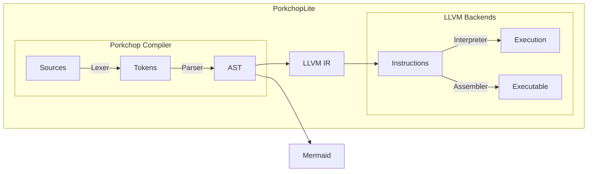

# PorkchopLite

Powered by Porkchop and LLVM

在使用之前，请先安装 Clang 和 LLVM。

```bash
sudo apt install clang
sudo apt install llvm
```


## 组件

PorkchopLite 如下图所示



## 编译器使用

```bash
cd build
cmake ..
vim main.pc # write code in this file
bash build.sh # build and run the program
```

产生的 `out.ll` 文件还可以根据需要自行编译成汇编或可执行文件。

如果需要额外添加外部函数，可以编辑 `lib/lib.c` 并在 `main.pc` 文件开头添加对应的函数声明。

## 示例代码片段

### 选择排序

```
fn print_int_array(array: *int, size: int): none
fn alloc_int_array(size: int): *int
fn dealloc_int_array(array: *int): none

fn swap(x: *int, y: *int): none = {
	let t = *x;
	*x = *y;
	*y = t;
}

fn min_element(a: *int, size: int, cmp: (int, int): bool): *int = {
	let p = a
	let i = 1
	while i < size {
		if cmp(a[i], *p) {
			p = &a[i]
		}
		++i
	}
	p
}

fn sort(a: *int, size: int, cmp: (int, int): bool): none = {
	let i = 0
	while i < size {
		swap(&a[i], min_element(&a[i], size - i, cmp))
		++i
	}
}


fn less(x: int, y: int) = x < y
fn greater(x: int, y: int) = x > y

fn main() = {
	let a = alloc_int_array(10)
	a[0] = 1
	a[1] = 2
	let i = 2
	while i < 10 {
		a[i] = a[i - 1] + a[i - 2]
		++i
	}
	print_int_array(a, 10)
	sort(a, 10, greater)
	print_int_array(a, 10)
	sort(a, 10, less)
	print_int_array(a, 10)
	dealloc_int_array(a)
}
```

编译成 LLVM IR：

```
declare void @print_int_array(i64* %0, i64 %1)
declare i64* @alloc_int_array(i64 %0)
declare void @dealloc_int_array(i64* %0)
define void @swap(i64* %0, i64* %1) {
L0:
    %2 = alloca i64*, align 8
    store i64* %0, i64** %2, align 8
    %3 = alloca i64*, align 8
    store i64* %1, i64** %3, align 8
    %4 = alloca i64, align 8
    %5 = load i64*, i64** %2, align 8
    %6 = load i64, i64* %5, align 8
    store i64 %6, i64* %4, align 8
    %7 = load i64*, i64** %3, align 8
    %8 = load i64, i64* %7, align 8
    %9 = load i64*, i64** %2, align 8
    store i64 %8, i64* %9, align 8
    %10 = load i64, i64* %4, align 8
    %11 = load i64*, i64** %3, align 8
    store i64 %10, i64* %11, align 8
    ret void
}
define i64* @min_element(i64* %0, i64 %1, ptr %2) {
L0:
    %3 = alloca i64*, align 8
    store i64* %0, i64** %3, align 8
    %4 = alloca i64, align 8
    store i64 %1, i64* %4, align 8
    %5 = alloca ptr, align 8
    store ptr %2, ptr %5, align 8
    %6 = alloca i64*, align 8
    %7 = alloca i64, align 8
    %8 = load i64*, i64** %3, align 8
    store i64* %8, i64** %6, align 8
    %9 = alloca i64, align 8
    store i64 1, i64* %9, align 8
    %10 = load i64, i64* %9, align 8
    store i64 %10, i64* %7, align 8
    br label %L1
L1:
    %11 = load i64, i64* %7, align 8
    %12 = load i64, i64* %4, align 8
    %13 = icmp slt i64 %11, %12
    br i1 %13, label %L2, label %L3
L2:
    %14 = load ptr, ptr %5, align 8
    %15 = load i64*, i64** %3, align 8
    %16 = load i64, i64* %7, align 8
    %17 = getelementptr inbounds i64, ptr %15, i64 %16
    %18 = load i64, i64* %17, align 8
    %19 = load i64*, i64** %6, align 8
    %20 = load i64, i64* %19, align 8
    %21 = call i1 %14(i64 %18, i64 %20)
    br i1 %21, label %L4, label %L5
L4:
    %22 = load i64*, i64** %3, align 8
    %23 = load i64, i64* %7, align 8
    %24 = getelementptr inbounds i64, ptr %22, i64 %23
    store i64* %24, i64** %6, align 8
    br label %L6
L5:
    br label %L6
L6:
    %25 = alloca i64, align 8
    store i64 1, i64* %25, align 8
    %26 = load i64, i64* %25, align 8
    %27 = load i64, i64* %7, align 8
    %28 = add i64 %27, %26
    store i64 %28, i64* %7, align 8
    br label %L1
L3:
    %29 = load i64*, i64** %6, align 8
    ret i64* %29
}
define void @sort(i64* %0, i64 %1, ptr %2) {
L0:
    %3 = alloca i64*, align 8
    store i64* %0, i64** %3, align 8
    %4 = alloca i64, align 8
    store i64 %1, i64* %4, align 8
    %5 = alloca ptr, align 8
    store ptr %2, ptr %5, align 8
    %6 = alloca i64, align 8
    %7 = alloca i64, align 8
    store i64 0, i64* %7, align 8
    %8 = load i64, i64* %7, align 8
    store i64 %8, i64* %6, align 8
    br label %L1
L1:
    %9 = load i64, i64* %6, align 8
    %10 = load i64, i64* %4, align 8
    %11 = icmp slt i64 %9, %10
    br i1 %11, label %L2, label %L3
L2:
    %12 = alloca ptr, align 8
    store ptr @swap, ptr %12, align 8
    %13 = load ptr, ptr %12, align 8
    %14 = load i64*, i64** %3, align 8
    %15 = load i64, i64* %6, align 8
    %16 = getelementptr inbounds i64, ptr %14, i64 %15
    %17 = alloca ptr, align 8
    store ptr @min_element, ptr %17, align 8
    %18 = load ptr, ptr %17, align 8
    %19 = load i64*, i64** %3, align 8
    %20 = load i64, i64* %6, align 8
    %21 = getelementptr inbounds i64, ptr %19, i64 %20
    %22 = load i64, i64* %4, align 8
    %23 = load i64, i64* %6, align 8
    %24 = sub i64 %22, %23
    %25 = load ptr, ptr %5, align 8
    %26 = call i64* %18(i64* %21, i64 %24, ptr %25)
    call void %13(i64* %16, i64* %26)
    %27 = alloca i64, align 8
    store i64 1, i64* %27, align 8
    %28 = load i64, i64* %27, align 8
    %29 = load i64, i64* %6, align 8
    %30 = add i64 %29, %28
    store i64 %30, i64* %6, align 8
    br label %L1
L3:
    ret void
}
define i1 @less(i64 %0, i64 %1) {
L0:
    %2 = alloca i64, align 8
    store i64 %0, i64* %2, align 8
    %3 = alloca i64, align 8
    store i64 %1, i64* %3, align 8
    %4 = load i64, i64* %2, align 8
    %5 = load i64, i64* %3, align 8
    %6 = icmp slt i64 %4, %5
    ret i1 %6
}
define i1 @greater(i64 %0, i64 %1) {
L0:
    %2 = alloca i64, align 8
    store i64 %0, i64* %2, align 8
    %3 = alloca i64, align 8
    store i64 %1, i64* %3, align 8
    %4 = load i64, i64* %2, align 8
    %5 = load i64, i64* %3, align 8
    %6 = icmp sgt i64 %4, %5
    ret i1 %6
}
define void @main() {
L0:
    %0 = alloca i64*, align 8
    %1 = alloca i64, align 8
    %2 = alloca ptr, align 8
    store ptr @alloc_int_array, ptr %2, align 8
    %3 = load ptr, ptr %2, align 8
    %4 = alloca i64, align 8
    store i64 10, i64* %4, align 8
    %5 = load i64, i64* %4, align 8
    %6 = call i64* %3(i64 %5)
    store i64* %6, i64** %0, align 8
    %7 = alloca i64, align 8
    store i64 1, i64* %7, align 8
    %8 = load i64, i64* %7, align 8
    %9 = load i64*, i64** %0, align 8
    %10 = alloca i64, align 8
    store i64 0, i64* %10, align 8
    %11 = load i64, i64* %10, align 8
    %12 = getelementptr inbounds i64, ptr %9, i64 %11
    store i64 %8, i64* %12, align 8
    %13 = alloca i64, align 8
    store i64 2, i64* %13, align 8
    %14 = load i64, i64* %13, align 8
    %15 = load i64*, i64** %0, align 8
    %16 = alloca i64, align 8
    store i64 1, i64* %16, align 8
    %17 = load i64, i64* %16, align 8
    %18 = getelementptr inbounds i64, ptr %15, i64 %17
    store i64 %14, i64* %18, align 8
    %19 = alloca i64, align 8
    store i64 2, i64* %19, align 8
    %20 = load i64, i64* %19, align 8
    store i64 %20, i64* %1, align 8
    br label %L1
L1:
    %21 = load i64, i64* %1, align 8
    %22 = alloca i64, align 8
    store i64 10, i64* %22, align 8
    %23 = load i64, i64* %22, align 8
    %24 = icmp slt i64 %21, %23
    br i1 %24, label %L2, label %L3
L2:
    %25 = load i64*, i64** %0, align 8
    %26 = load i64, i64* %1, align 8
    %27 = alloca i64, align 8
    store i64 1, i64* %27, align 8
    %28 = load i64, i64* %27, align 8
    %29 = sub i64 %26, %28
    %30 = getelementptr inbounds i64, ptr %25, i64 %29
    %31 = load i64, i64* %30, align 8
    %32 = load i64*, i64** %0, align 8
    %33 = load i64, i64* %1, align 8
    %34 = alloca i64, align 8
    store i64 2, i64* %34, align 8
    %35 = load i64, i64* %34, align 8
    %36 = sub i64 %33, %35
    %37 = getelementptr inbounds i64, ptr %32, i64 %36
    %38 = load i64, i64* %37, align 8
    %39 = add i64 %31, %38
    %40 = load i64*, i64** %0, align 8
    %41 = load i64, i64* %1, align 8
    %42 = getelementptr inbounds i64, ptr %40, i64 %41
    store i64 %39, i64* %42, align 8
    %43 = alloca i64, align 8
    store i64 1, i64* %43, align 8
    %44 = load i64, i64* %43, align 8
    %45 = load i64, i64* %1, align 8
    %46 = add i64 %45, %44
    store i64 %46, i64* %1, align 8
    br label %L1
L3:
    %47 = alloca ptr, align 8
    store ptr @print_int_array, ptr %47, align 8
    %48 = load ptr, ptr %47, align 8
    %49 = load i64*, i64** %0, align 8
    %50 = alloca i64, align 8
    store i64 10, i64* %50, align 8
    %51 = load i64, i64* %50, align 8
    call void %48(i64* %49, i64 %51)
    %52 = alloca ptr, align 8
    store ptr @sort, ptr %52, align 8
    %53 = load ptr, ptr %52, align 8
    %54 = load i64*, i64** %0, align 8
    %55 = alloca i64, align 8
    store i64 10, i64* %55, align 8
    %56 = load i64, i64* %55, align 8
    %57 = alloca ptr, align 8
    store ptr @greater, ptr %57, align 8
    %58 = load ptr, ptr %57, align 8
    call void %53(i64* %54, i64 %56, ptr %58)
    %59 = alloca ptr, align 8
    store ptr @print_int_array, ptr %59, align 8
    %60 = load ptr, ptr %59, align 8
    %61 = load i64*, i64** %0, align 8
    %62 = alloca i64, align 8
    store i64 10, i64* %62, align 8
    %63 = load i64, i64* %62, align 8
    call void %60(i64* %61, i64 %63)
    %64 = alloca ptr, align 8
    store ptr @sort, ptr %64, align 8
    %65 = load ptr, ptr %64, align 8
    %66 = load i64*, i64** %0, align 8
    %67 = alloca i64, align 8
    store i64 10, i64* %67, align 8
    %68 = load i64, i64* %67, align 8
    %69 = alloca ptr, align 8
    store ptr @less, ptr %69, align 8
    %70 = load ptr, ptr %69, align 8
    call void %65(i64* %66, i64 %68, ptr %70)
    %71 = alloca ptr, align 8
    store ptr @print_int_array, ptr %71, align 8
    %72 = load ptr, ptr %71, align 8
    %73 = load i64*, i64** %0, align 8
    %74 = alloca i64, align 8
    store i64 10, i64* %74, align 8
    %75 = load i64, i64* %74, align 8
    call void %72(i64* %73, i64 %75)
    %76 = alloca ptr, align 8
    store ptr @dealloc_int_array, ptr %76, align 8
    %77 = load ptr, ptr %76, align 8
    %78 = load i64*, i64** %0, align 8
    call void %77(i64* %78)
    ret void
}
```

程序运行结果：

```
1 2 3 5 8 13 21 34 55 89 
89 55 34 21 13 8 5 3 2 1
1 2 3 5 8 13 21 34 55 89
```

# PorkchopLite 语法介绍

### 注释

在 PorkchopLite 中，注释由 # 引导，之后的文本都会被忽略。

> 🚧 待施工
