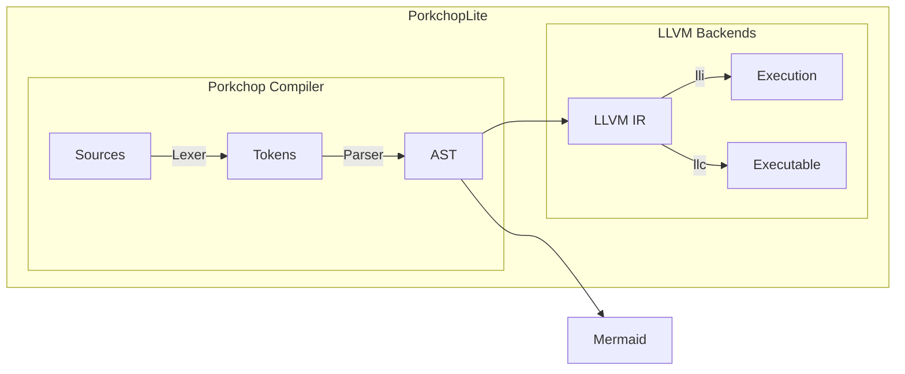

# PorkchopLite

Powered by Porkchop and LLVM

在使用之前，请先安装 Clang 和 LLVM。

```bash
sudo apt install clang
sudo apt install llvm
```

请使用 LLVM 14

## 组件

PorkchopLite 如下图所示



## 编译器使用

```bash
git clone https://github.com/Yaossg/PorkchopLite.git
cd PorkchopLite
bash init.sh
cd build
bash pcmake.sh <args...>
```

### PorkchopLite 使用

```
PorkchopLite <input> <options...>
```

- `<input>` 输入的 Porkchop 源代码
- 选项
  - `-o <output>` 指定输出文件名
  - `-g` 生成调试信息
  - `-l` 输出 LLVM IR
  - `-m` 输出 Mermaid

### pcmake.sh

```
bash pcmake.sh <input> <options...>
```

- `<input>` 任意数量的 `.c` C 语言源代码或 `.pc` Porkchop 语言源代码文件
- 选项
  - `-o <output>` 指定输出文件文件名，默认为 `a.out`
  - `-g` 生成调试信息
  - `-i` 解释执行，不生成可执行文件
  - `-v` 不清理编译过程的中间文件

## 示例代码片段

更多的示例代码片段参见 `/test` 目录

### 选择排序

```
fn alloc(size: int): *none
fn dealloc(array: *none): none
fn print_int_array(array: *int, size: int): none

fn swap(x: *int, y: *int): none = {
	let t = *x;
	*x = *y;
	*y = t;
}


fn min_element(p: *int, q: *int, cmp: (int, int): bool): *int = {
	let m = p
	while p != q {
		if cmp(*p, *m) {
			m = p
		}
		++p
	}
	m
}

fn sort(p: *int, q: *int, cmp: (int, int): bool): none = {
	while p != q {
		swap(p, min_element(p, q, cmp))
		++p
	}
}

fn less(x: int, y: int) = x < y
fn greater(x: int, y: int) = x > y

fn main() = {
	let a = alloc(10 * sizeof(int)) as *int
	a[0] = 1
	a[1] = 2
	let i = 2
	while i < 10 {
		a[i] = a[i - 1] + a[i - 2]
		++i
	}
	print_int_array(a, 10)
	sort(a, a + 10, greater)
	print_int_array(a, 10)
	sort(a, a + 10, less)
	print_int_array(a, 10)
	dealloc(a as *none)
}
```

编译成 LLVM IR：

```
declare ptr @alloc(i64 %0)
declare void @dealloc(ptr %0)
declare void @print_int_array(ptr %0, i64 %1)
define void @swap(ptr %0, ptr %1) {
L0:
    %2 = alloca ptr
    store ptr %0, ptr %2
    %3 = alloca ptr
    store ptr %1, ptr %3
    %4 = alloca i64
    %5 = load ptr, ptr %2
    %6 = load i64, ptr %5
    store i64 %6, ptr %4
    %7 = load ptr, ptr %3
    %8 = load i64, ptr %7
    %9 = load ptr, ptr %2
    store i64 %8, ptr %9
    %10 = load i64, ptr %4
    %11 = load ptr, ptr %3
    store i64 %10, ptr %11
    ret void
}
define ptr @min_element(ptr %0, ptr %1, ptr %2) {
L0:
    %3 = alloca ptr
    store ptr %0, ptr %3
    %4 = alloca ptr
    store ptr %1, ptr %4
    %5 = alloca ptr
    store ptr %2, ptr %5
    %6 = alloca ptr
    %7 = load ptr, ptr %3
    store ptr %7, ptr %6
    br label %L1
L1:
    %8 = load ptr, ptr %3
    %9 = load ptr, ptr %4
    %10 = icmp ne ptr %8, %9
    br i1 %10, label %L2, label %L3
L2:
    %11 = load ptr, ptr %5
    %12 = load ptr, ptr %3
    %13 = load i64, ptr %12
    %14 = load ptr, ptr %6
    %15 = load i64, ptr %14
    %16 = call i1 %11(i64 %13, i64 %15)
    br i1 %16, label %L4, label %L5
L4:
    %17 = load ptr, ptr %3
    store ptr %17, ptr %6
    br label %L6
L5:
    br label %L6
L6:
    %18 = load ptr, ptr %3
    %19 = getelementptr inbounds ptr, ptr %18, i64 1
    store ptr %19, ptr %3
    br label %L1
L3:
    %20 = load ptr, ptr %6
    ret ptr %20
}
define void @sort(ptr %0, ptr %1, ptr %2) {
L0:
    %3 = alloca ptr
    store ptr %0, ptr %3
    %4 = alloca ptr
    store ptr %1, ptr %4
    %5 = alloca ptr
    store ptr %2, ptr %5
    br label %L1
L1:
    %6 = load ptr, ptr %3
    %7 = load ptr, ptr %4
    %8 = icmp ne ptr %6, %7
    br i1 %8, label %L2, label %L3
L2:
    %9 = load ptr, ptr %3
    %10 = load ptr, ptr %3
    %11 = load ptr, ptr %4
    %12 = load ptr, ptr %5
    %13 = call ptr @min_element(ptr %10, ptr %11, ptr %12)
    call void @swap(ptr %9, ptr %13)
    %14 = load ptr, ptr %3
    %15 = getelementptr inbounds ptr, ptr %14, i64 1
    store ptr %15, ptr %3
    br label %L1
L3:
    ret void
}
define i1 @less(i64 %0, i64 %1) {
L0:
    %2 = alloca i64
    store i64 %0, ptr %2
    %3 = alloca i64
    store i64 %1, ptr %3
    %4 = load i64, ptr %2
    %5 = load i64, ptr %3
    %6 = icmp slt i64 %4, %5
    ret i1 %6
}
define i1 @greater(i64 %0, i64 %1) {
L0:
    %2 = alloca i64
    store i64 %0, ptr %2
    %3 = alloca i64
    store i64 %1, ptr %3
    %4 = load i64, ptr %2
    %5 = load i64, ptr %3
    %6 = icmp sgt i64 %4, %5
    ret i1 %6
}
define void @main() {
L0:
    %0 = alloca ptr
    %1 = alloca i64
    %2 = mul i64 10, 8
    %3 = call ptr @alloc(i64 %2)
    store ptr %3, ptr %0
    %4 = load ptr, ptr %0
    %5 = getelementptr inbounds i64, ptr %4, i64 0
    store i64 1, ptr %5
    %6 = load ptr, ptr %0
    %7 = getelementptr inbounds i64, ptr %6, i64 1
    store i64 2, ptr %7
    store i64 2, ptr %1
    br label %L1
L1:
    %8 = load i64, ptr %1
    %9 = icmp slt i64 %8, 10
    br i1 %9, label %L2, label %L3
L2:
    %10 = load ptr, ptr %0
    %11 = load i64, ptr %1
    %12 = sub i64 %11, 1
    %13 = getelementptr inbounds i64, ptr %10, i64 %12
    %14 = load i64, ptr %13
    %15 = load ptr, ptr %0
    %16 = load i64, ptr %1
    %17 = sub i64 %16, 2
    %18 = getelementptr inbounds i64, ptr %15, i64 %17
    %19 = load i64, ptr %18
    %20 = add i64 %14, %19
    %21 = load ptr, ptr %0
    %22 = load i64, ptr %1
    %23 = getelementptr inbounds i64, ptr %21, i64 %22
    store i64 %20, ptr %23
    %24 = load i64, ptr %1
    %25 = add i64 %24, 1
    store i64 %25, ptr %1
    br label %L1
L3:
    %26 = load ptr, ptr %0
    call void @print_int_array(ptr %26, i64 10)
    %27 = load ptr, ptr %0
    %28 = load ptr, ptr %0
    %29 = getelementptr inbounds ptr, ptr %28, i64 10
    call void @sort(ptr %27, ptr %29, ptr @greater)
    %30 = load ptr, ptr %0
    call void @print_int_array(ptr %30, i64 10)
    %31 = load ptr, ptr %0
    %32 = load ptr, ptr %0
    %33 = getelementptr inbounds ptr, ptr %32, i64 10
    call void @sort(ptr %31, ptr %33, ptr @less)
    %34 = load ptr, ptr %0
    call void @print_int_array(ptr %34, i64 10)
    %35 = load ptr, ptr %0
    call void @dealloc(ptr %35)
    ret void
}
```

程序运行结果：

```
1 2 3 5 8 13 21 34 55 89 
89 55 34 21 13 8 5 3 2 1
1 2 3 5 8 13 21 34 55 89
```

# PorkchopLite 语法介绍

### 注释

在 PorkchopLite 中，注释由 # 引导，之后的文本都会被忽略。

### 源文件

与 Porkchop 不同，PorkchopLite 的源文件顶层不是一个表达而，而是只允许全局函数和全局变量的声明和定义。程序的入口是 `main`。如果没有 `main`，程序虽然不可以执行，但是可以作为其它程序的库使用。

需要注意的是，`main` 函数的推荐返回类型是 `int`，返回其它类型在语法上不会出错，但是执行后返回的结果是未定义的。

### 多文件

Porkchop 支持多文件。全局的函数可以通过 `export` 关键字导出

```
# src/hello.pc

export fn hello() = 42
```

在另外一个文件中，就可以通过相对路径进行访问

```
# src/main.pc
import "hello.pc"

fn main() = hello()
```

此外，从其它文件 `import` 得来的标识符默认是不会 `export` 的。你可以在 `import` 前面加 `export` 再进行导出。

```
export import "hello.pc" # re-export imported hello()
```

### 万物皆为表达式

在 PorkchopLite 中，除了全局的声明和定义，万物皆为表达式。用花括号括起来的多个表达式算作一个复合表达式。这个复合表达式的值，就是其中最后一个表达式的值。

```
{
    2 * 3
    2 + 3
} # 这个表达式的值为 5
```

在花括号中，分割表达式时，分号不是必须的，换行就行。如果你希望书写多行的表达式，可以利用在行末添加一个反斜杠 `\`，来取消换行符：

```
{
    2\
    +\
    3
} # 这个表达式的值为 5
```

也可以利用圆括号、方括号配对时忽略中间换行符的特性：

```
{
    (2
    +
    3)
} # 这个表达式的值为 5
```

### Unicode 支持

PorkchopLite 的源文件必须是一个 UTF-8 文件。PorkchopLite 的标识符都支持 Unicode。

错误报告在对齐的等宽字体下可以看到更好的效果。但为了实现对齐，PorkchopLite 会把代码中的制表符无条件转换为至多四个空格，即使是在字符串当中。如果有需要，请在字符串中使用 `\t` 来表示制表符。如果源代码中包含 `\0` 源程序将会被认为在此提前结束。


## 类型和变量

let 关键字引导变量声明，并进行初始化：

```
fn main() = {
    let a: int = 0 # int 类型的变量 a，初始化为 0
    let b = 0.0    # 省略类型，b 自动推导为 float
    # let 也是表达式，返回 b 的值
} # 所以这个表达式的值为 0.0
```

PorkchopLite 有这些基本类型：
```
none   # 表示没有值的类型
never  # 不会返回的类型，如 exit(0) 的类型即为 never
bool   # true 和 false 的类型是 bool
int    # 八字节有符号整数，如 0
float  # 八字节双精度浮点数，如 0.0
```

整数支持二（0b）、八（0o）、十、十六（0x）进制，浮点数支持十、十六（0x）进制。整数和浮点数的字面量中可以插入下划线，来作为数字分隔符：

```
fn main() = {
    1234_5678 # ok
    1_23_456  # ok
    1_23.456  # ok
    123_ # error: 非法的数字
    _123 # error: 找不到标识符
}
```

浮点数支持科学计数法，此外还有 `inf` 和 `nan` 两个关键字作为字面量。

类型检查是非常严格的，例如：

```
fn main() = {
    let apple = 10
    let banana = 10.0
    apple + banana * 2.0
}
```

将会导致编译错误：

```
error: type mismatch on both operands
   4  | apple + banana * 2.0
      | ^~~~~~~~~~~~~~~~~~~~
note: type of left operand is 'int'
   4  | apple + banana * 2.0
      | ^~~~~
note: type of right operand is 'float'
   4  | apple + banana * 2.0
      |         ^~~~~~~~~~~~
```

唯一的例外是，任何类型的值都可以无条件隐式转换为 `none`，也就是忽略表达式的值。`none` 存在一个隐变量 `_`，处处可供存取。

```
fn main() = {
    _ = 1 # discard this one
    
    _  # none
    () # none
    {} # none
}
```

可以用 as 运算符强制类型转换

```
fn main() = {
    let a = 10
    let b = 10.0
    let c: int = a + b as int
    let d: float = a as float + b
}
```

任何类型都可以用 `as` 转换到自身、`none` ，故省略不表。

需要注意的是，由于没有字符类型，字符字面量的类型是 `int`。


## 运算符

下表包含了 Porkchop 所有的运算符。其中初等表达式也在列，方便观察。

| 优先级 | 结合性 | 运算符     | 运算符                                                       |
| ------ | ------ | ---------- | ------------------------------------------------------------ |
| 0      | -      | 初等表达式 | 布尔、字符、整数、浮点数字面量<br>圆括号、花括号、标识符<br> `while` `if` `fn` `let` |
| 1      | LR     | 后缀       | 函数调用、`as`<br>下标访问、后缀自增自减                     |
| 2      | RL     | 前缀       | 正负号、按位取反、逻辑取反<br/>前缀自增自减、取地址、解引用  |
| 3      | LR     | 乘除余in   | 乘法、除法、求余、中缀函数调用                               |
| 4      | LR     | 加减       | 加法、减法                                                   |
| 5      | LR     | 位移       | 左移、算术右移、逻辑右移                                     |
| 6      | LR     | 大小比较   | 小于、大于、小于等于、大于等于                               |
| 7      | LR     | 等于比较   | 等于、不等于                                                 |
| 8      | LR     | 按位与     | 按位与                                                       |
| 9      | LR     | 按位异或   | 按位异或                                                     |
| 10     | LR     | 按位或     | 按位或                                                       |
| 11     | LR     | 逻辑与     | 逻辑与                                                       |
| 12     | LR     | 逻辑或     | 逻辑或                                                       |
| 13     | RL     | 赋值       | 赋值、复合赋值<br>`return` `break`                           |

### 算术运算

算术类型包括 `int` 和 `float`，它们可以参与算术运算，包含加减乘除余。

整数除法和求余时，除数不可以为 0。

加号还可以用来连接字符串。若加号两侧任意一个操作数是字符串，则另一侧的操作数也会隐式被转换为字符串与之连接。

自增自减运算符仅可用于 `int`。

### 位运算

位运算类型包括 `int` ，它们可以参与位运算，包括左移、算术右移、逻辑右移、按位与、按位异或、按位或、按位取反。

进行位移运算时，右操作数若为负数，结果是未定义的。

### 逻辑运算

逻辑与和逻辑或采用短路求值。

### 比较运算

浮点数比较参见 IEEE 754。

## 流程控制

只有一个子句的 if 表达式返回 none

```
fn main() = {
    let a = 0
    if a == 0 {
        1
    } # none
}
```

有两个子句的 if 相当于三目表达式

```
fn main() = {
    let a = 1
    let b = 2
    let m = if a > b { a } else { b }
}
```

else 后面直接 if 可以不用花括号，构成 else if

while 表达式，默认返回值为 none

```
fn main() = {
    let i = 1
    let s = 0
    while i < 10 {
        s += i
        i += 1
    } # none
}
```

可以使用 break 来跳出循环。无限循环如果不跳出则循环返回值视为 never

```
fn main() = {
    while true {
        break
    } # none
    
    while true {
    
    } # never
}
```

## 全局函数和全局变量

与 Porkchop 不同，PorkchopLite 只支持全局函数，同时引入了全局变量的概念。

fn 关键字引导全局函数，参数如下所示，返回值可以指定也可以推导，参数类型必须指定。

```
fn square(x: int) = {
    x * x
}
```

函数也可以作为参数传递

```
fn caller(callback: (int): int) = {
    callback(4)
}

fn main() = {
    caller(square) # 16
}
```

可以用 return 提前返回，也可以直接利用表达式求得。

全局变量则是定义在全局的 `let` 表达式，需要注意的是全局变量的初始化器必须是常数。

```
let a = 1      # ok
let b = 1 + 1  # ok
let c = b + 1  # error

fn main() = {}
```

## 指针

> 当你用一根手指指着别人的时候，别忘了有三根手指指着自己。

是的，PorkchopLite 支持指针！这允许你实现更多的功能，但也需要你更为小心，因为 Porkchop 没有虚拟机，一切的内存错误和泄露都是可能发生的！

> 🚧 待施工

## 语法糖专题

### 中缀函数调用

如果函数接受恰好两个参数，那么你可以使用中缀的方式调用它。

```
fn max(a: int, b: int) = if a > b {a} else {b}


fn main() = {
	3 max 4 # 输出 4
}
```
